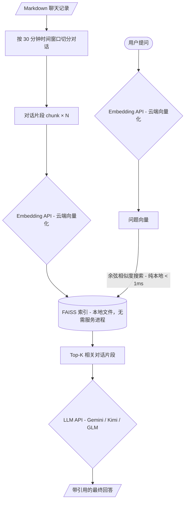

# WechatLLM — Mac 微信本地知识库提取工具箱 🚀

从本地微信数据库中完整导出聊天记录，生成结构化 Markdown 文件，可直接用于 GPT / Claude 知识库微调或本地 RAG 问答。

**支持环境**：macOS 微信 v4.x（原生新款）｜ Python 3.11+

---

## 🖥️ 快速开始（可视化界面）

### 1. 环境准备

```bash
# 克隆项目并进入目录
git clone <repo_url> && cd WechatLLM

# 创建虚拟环境并安装依赖
python3 -m venv venv
source venv/bin/activate
pip install -r requirements.txt
```

### 2. 配置 API Key（用于 RAG 问答）

```bash
cp .env.example .env
# 用编辑器打开 .env，填入以下内容：
#   EMBED_API_KEY    — Embedding 服务的 API Key
#   EMBED_BASE_URL   — Embedding 服务地址（默认硅基流动，可换其他兼容 OpenAI 的服务）
#   EMBED_MODEL      — Embedding 模型名称（默认 BAAI/bge-m3）
#   LLM_API_KEY      — LLM 的 API Key（Gemini / Kimi / GLM 等）
#   LLM_BASE_URL     — LLM 的 base_url
#   LLM_MODEL        — LLM 模型名称（默认 gemini-2.0-flash）
```

### 3. 启动可视化控制台

```bash
source venv/bin/activate
streamlit run app.py
```

浏览器会自动打开 `http://localhost:8501`，页面功能说明：

| 左侧边栏 | 右侧主区域 |
|---|---|
| 🔓 **解密数据库**：填密钥 + 账号目录，一键解密 | 📋 **联系人列表**：自动加载，支持搜索 |
| 📁 **导出目录**：配置 Markdown 输出路径 | ☑️ 勾选会话后批量导出，带进度条 |
| 🧠 **RAG 问答配置**：填入 Embedding 和 LLM Key | 💬 **知识库问答**：语义检索 + 带引用回答 |

> **已有解密数据？** 若 `~/wechat_db_backup/db_storage` 下已有数据，启动后联系人列表**自动展示**，无需重复解密。

---

## 🔑 步骤 0：获取微信数据库密钥

> [!WARNING]
> **必须提前关闭 macOS SIP（系统完整性保护）**
>
> 运行 `csrutil status` 确认是否已关闭。若未关闭：
> 1. 完全关机 → 长按电源键进入恢复模式（Intel Mac：`Command+R`）
> 2. 打开终端，执行 `csrutil disable` → 重启
> 3. *(导出完成后可重新执行 `csrutil enable` 恢复保护)*

**密钥提取步骤：**

1. 彻底退出微信（状态栏也不能有微信图标）
2. 打开终端，执行：
   ```bash
   sudo lldb -n WeChat -w
   ```
3. **立刻点击打开微信**，等待终端出现 `(lldb)` 提示符
4. 执行以下命令打断点并继续：
   ```text
   br set -n CCKeyDerivationPBKDF
   c
   ```
5. **在手机上扫码登录微信**，微信会再次被断点捕获
6. 在 `(lldb)` 中读取密钥：
   ```text
   memory read --size 1 --format x --count 32 $x1
   ```
   将输出的 32 个 `0x??` 去掉 `0x` 拼接成 64 位 hex 字符串，即为密钥
7. 执行 `detach` → `quit` 释放微信

将密钥保存至 `wechat_db_key.txt` 备用。

---

## 🔓 解密数据库

在可视化界面左侧"🔓 解密数据库"区域填入：
- **数据库密钥**（64 位 hex）
- **微信账号目录**（自动识别，下拉选择）
- **解密输出目录**（默认 `~/wechat_db_backup`）

点击"🔑 开始解密"即可。解密完成后右侧联系人列表自动刷新。

---

## 🧠 知识库问答（RAG）

### 架构原理

> 无需部署任何本地服务。Embedding 和 LLM 均调用在线 API；向量存储使用 FAISS 纯 Python 库，索引以文件形式保存在本地磁盘，无需守护进程。



**两处云 API 调用（需网络）：**
- `Embedding API`：把文字转成向量（构建索引时 + 用户提问时）
- `LLM API`：根据检索到的片段生成最终回答

**完全本地（无网络、无服务进程）：**
- `FAISS` 向量相似度搜索 —— 读取本地 `.faiss` 文件做内存计算

---

### 操作步骤

1. 先在右侧勾选会话 → 点"🚀 导出选定"导出为 Markdown
2. 展开左侧"🧠 RAG 问答配置"，确认 Key 已填入（从 `.env` 自动读取）
3. 右侧底部点"🔧 构建 / 更新索引"（使用 FAISS + bge-m3 向量化）
4. 索引完成后直接在聊天框提问，回答附带原文引用时间段

**支持切换 LLM 模型**（仅改 `.env` 三行即可）：

| 模型 | LLM_BASE_URL |
|---|---|
| Gemini（默认）| `https://generativelanguage.googleapis.com/v1beta/openai/` |
| Kimi | `https://api.moonshot.cn/v1` |
| GLM | `https://open.bigmodel.cn/api/paas/v4/` |
| DeepSeek | `https://api.deepseek.com/v1` |


---

## ⌨️ 极客模式（仅命令行）

如果不想启动 Web UI，可直接调用 Python 脚本：

**解密数据库：**
```bash
source venv/bin/activate
python3 decrypt_wechat_db.py decrypt \
  -k "你的64位密钥" \
  -p darwin -v 4 \
  -d "/Users/用户名/Library/Containers/com.tencent.xinWeChat/Data/Documents/xwechat_files/<账号目录>" \
  -o ~/wechat_db_backup
```

**导出指定会话：**
```bash
python3 export_group.py "公共技术部"
```

**可选环境变量：**
```bash
export WECHATLLM_DB_DIR=~/wechat_db_backup/db_storage
export WECHATLLM_OUT_DIR=~/wechat_export
```

---

## 💻 系统要求

> 计算密集的 Embedding 和 LLM 推理均外包给云端 API，本地只需运行 Streamlit + FAISS 检索，对硬件要求极低。

| 项目 | 最低要求 | 说明 |
|---|---|---|
| **操作系统** | macOS（当前） | 解密逻辑依赖 macOS 路径；导出/RAG 部分跨平台 |
| **CPU** | 任意现代 CPU | FAISS 是纯 CPU 内存运算，无需 GPU |
| **内存** | ≥ 2 GB 可用 | FAISS 索引加载进内存，约 50~200 MB |
| **磁盘** | ≥ 500 MB 空余 | Markdown + FAISS 索引 + Python 虚拟环境 |
| **GPU** | ❌ 不需要 | 所有推理均走云端 API |
| **网络** | 能访问 API 端点 | 仅向量化与 LLM 生成时出网；FAISS 检索完全离线 |

---

## 🦙 完全离线模式（本地 Ollama）

如需在无网络或隐私敏感场景下运行，可将 Embedding 和 LLM 全部替换为本地 Ollama，**代码无需任何修改**，只改 `.env` 即可。

### 1. 安装 Ollama 并拉取模型

```bash
# 安装 Ollama（官网：https://ollama.com）
brew install ollama

# 拉取 Embedding 模型（支持中文，约 274 MB）
ollama pull nomic-embed-text

# 拉取 LLM 模型（任选其一）
ollama pull qwen2.5:7b      # 阿里通义千问，中文友好，约 4.7 GB
ollama pull deepseek-r1:8b  # DeepSeek，推理能力强，约 4.9 GB
ollama pull llama3.2:3b     # Meta Llama，轻量，约 2 GB
```

### 2. 修改 `.env` 指向本地 Ollama

```bash
# Embedding（Ollama 兼容 OpenAI Embedding 接口）
EMBED_API_KEY=ollama
EMBED_BASE_URL=http://localhost:11434/v1
EMBED_MODEL=nomic-embed-text

# LLM
LLM_API_KEY=ollama
LLM_BASE_URL=http://localhost:11434/v1
LLM_MODEL=qwen2.5:7b
```

### 3. 启动 Ollama 服务后正常使用

```bash
ollama serve   # 保持终端窗口开着（或设置为后台服务）
streamlit run app.py
```

> **离线模式硬件建议**：运行 7B 参数模型推荐 ≥ 16 GB 内存（Apple Silicon M 系列效果最佳）；3B 模型在 8 GB 内存下也可流畅运行。

---

## 🧯 常见问题

| 问题 | 排查方法 |
|---|---|
| 未检测到联系人库 | 确认 `~/wechat_db_backup/db_storage/contact/contact.db` 存在 |
| `查无数据库表: Msg_<md5>` | 该会话无本地消息或已清理，可跳过 |
| 图片提取失败但文本正常 | 部分图片为 V2 加密格式，不影响文本导出 |
| ChromaDB 报 Pydantic 错误 | 已替换为 FAISS，重装依赖 `pip install -r requirements.txt` |
| Ollama 连接失败 | 确认 `ollama serve` 正在运行，默认端口 11434 |

---

尽情享用属于你自己的本地知识库进行 AI 对话与微调！🤖✨
