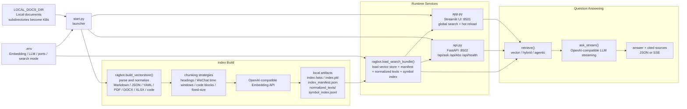
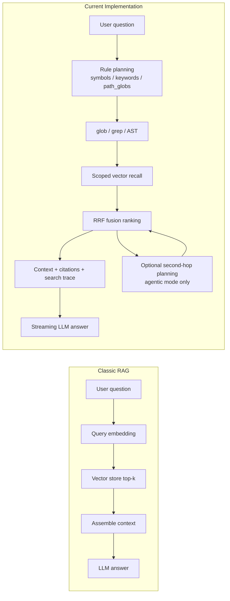

# OpenCortex

[](https://www.python.org/)
[](LICENSE)
[](https://streamlit.io/)
[](https://github.com/facebookresearch/faiss)

**A lightweight, local-first RAG chatbot.** Point it at a local directory, let it index your documents, then chat with them using any OpenAI-compatible LLM — all running on your own machine.

[中文文档](README.zh-CN.md)

---

## Features

- **Zero-config single-page UI** — Streamlit, no settings page needed
- **Recursive indexing** — supports `.md`, `.txt`, `.json`, `.yaml`, `.csv`, `.rst`, `.log`, `.docx`, `.xlsx`, `.pdf`, and more
- **WeChat export support** — natively parses WeChat-exported Markdown with time-window chunking
- **Pluggable LLM & embeddings** — any OpenAI-compatible API: SiliconFlow, Gemini, DeepSeek, Kimi, GLM, etc.
- **Local FAISS vector store** — no cloud dependency, data stays on your machine
- **Hybrid / Agentic Search** — combines `glob + grep + AST + vector`, with a bounded second retrieval hop
- **Multi-knowledge-base** — subdirectories under `docs/` become named knowledge bases; API can target a specific KB or search globally
- **HTTP API** — FastAPI endpoints (`/api/ask`, `/api/kbs`, `/api/health`) with `search_mode` and SSE streaming support
- **Hot-reload** — update your docs and trigger re-indexing without restarting the server
- **Docker deployment** — serve the same knowledge base to multiple users on a LAN

---

## Architecture



Key implementation details:

1. `start.py` rebuilds the index by default, then launches Streamlit and Uvicorn as parallel subprocesses.
2. `ragbot.py` persists more than FAISS alone: `index_manifest.json`, `normalized_texts/`, and `symbol_index.jsonl` are also written for hybrid / agentic retrieval.
3. `app.py` only exposes global search, but watches the `index.faiss` mtime and clears its cached `SearchBundle` when the index changes.
4. `api.py` loads the same `SearchBundle` during FastAPI lifespan startup and exposes `kb`, `search_mode`, `stream`, and `debug` controls.

### Request Flow

1. The UI or API receives a question and calls `ragbot.ask_stream()`.
2. `retrieve()` runs `vector` or `hybrid` retrieval first; `agentic` may add one bounded second hop when needed.
3. Retrieved hits are turned into context and citations, then passed to any OpenAI-compatible LLM for streaming generation.
4. Streamlit renders the streamed answer plus source cards, while FastAPI returns JSON or SSE events.

### How This Differs From Classic RAG



- `vector` mode is still the classic single-route vector RAG path, useful as a baseline for behavior and latency.
- The default `hybrid` mode fuses rule-based retrieval with vector retrieval, which works better for exact filenames, symbols, and config keys.
- `agentic` is not an open-ended agent loop; it adds at most one bounded second retrieval hop when the first pass is not decisive.

---

## Quick Start

### Local (recommended for personal use)

Requires Python 3.12.

```bash
git clone https://github.com/yahuo/OpenCortex.git
cd OpenCortex

python3.12 -m venv venv
source venv/bin/activate       # Windows: venv\Scripts\activate
pip install -r requirements.txt

cp .env.example .env
# Edit .env — set LOCAL_DOCS_DIR, EMBED_API_KEY, LLM_API_KEY at minimum
```

Start the app (rebuilds index, then opens the web server):

```bash
source venv/bin/activate
python3 start.py
```

Then open `http://localhost:8501` in your browser.

### Docker (LAN multi-user)

Requires Docker and Docker Compose v2.

```bash
cp .env.example .env
# Edit .env — set LOCAL_DOCS_DIR, EMBED_API_KEY, LLM_API_KEY
# Use absolute paths for LOCAL_DOCS_DIR and CHROMA_PERSIST_DIR
```

**First deployment:**

```bash
docker compose build
docker compose run --rm app python start.py --rebuild-only   # build index
docker compose up -d                                          # start service
```

Access via `http://<server-ip>:8501`, API via `http://<server-ip>:8502`.

**Reload docs without restarting:**

```bash
docker compose exec app python start.py --rebuild-only
# Then refresh the browser — new index loads automatically
```

`docker compose up -d` uses the image default command `python start.py --skip-rebuild`, so container startup will not rebuild the index every time.

**Common ops:**

```bash
docker compose logs -f    # tail logs
docker compose down       # stop
docker compose up -d      # restart
```

---

## Configuration

Copy `.env.example` to `.env` and fill in the required values.

| Variable | Required | Default | Description |
|---|:---:|---|---|
| `LOCAL_DOCS_DIR` | ✅ | `./docs` | Directory to index (recursively) |
| `EMBED_API_KEY` | ✅ | — | API key for embedding service |
| `EMBED_BASE_URL` | | `https://api.siliconflow.cn/v1` | Embedding API base URL |
| `EMBED_MODEL` | | `BAAI/bge-m3` | Embedding model name |
| `LLM_API_KEY` | ✅ | — | API key for the LLM |
| `LLM_BASE_URL` | | `https://generativelanguage.googleapis.com/v1beta/openai/` | LLM API base URL |
| `LLM_MODEL` | | `gemini-2.0-flash` | LLM model name |
| `CHROMA_PERSIST_DIR` | | `~/wechat_rag_db` | Directory to persist the FAISS index |
| `SEARCH_MODE` | | `hybrid` | Default retrieval mode: `vector`, `hybrid`, or `agentic` |
| `SEARCH_MAX_STEPS` | | `2` | Max retrieval steps for agentic mode, only `1` or `2` |
| `EXCLUDE_GLOBS` | | — | Extra ignore patterns, comma-separated |
| `SEARCH_DEBUG` | | — | Show retrieval trace in Streamlit |
| `APP_HOST` | | `127.0.0.1` | Server bind address |
| `APP_PORT` | | `8501` | Streamlit server port |
| `API_PORT` | | `8502` | FastAPI server port |

**Compatible LLM providers** (set `LLM_BASE_URL` accordingly):

| Provider | Base URL |
|---|---|
| Gemini | `https://generativelanguage.googleapis.com/v1beta/openai/` |
| DeepSeek | `https://api.deepseek.com/v1` |
| Kimi (Moonshot) | `https://api.moonshot.cn/v1` |
| GLM (Zhipu) | `https://open.bigmodel.cn/api/paas/v4/` |
| SiliconFlow | `https://api.siliconflow.cn/v1` |

---

## Supported File Types

| Extension | Chunking strategy |
|---|---|
| `.md`, `.markdown`, `.mdx` | WeChat format → time-window chunks; otherwise fixed-size |
| `.txt`, `.rst`, `.log` | Fixed-size with overlap |
| `.csv`, `.json`, `.yaml`, `.yml` | Fixed-size with overlap |
| `.docx`, `.xlsx`, `.pdf` | markitdown → Markdown → fixed-size with overlap |

---

## HTTP API

In addition to the Streamlit UI, OpenCortex exposes a FastAPI-based HTTP API (`api.py`) for programmatic access.

`start.py` launches the FastAPI server on port `8502` alongside Streamlit. You can also run it standalone:

```bash
uvicorn api:app --host 127.0.0.1 --port 8502
```

| Endpoint | Method | Description |
|---|---|---|
| `/api/health` | GET | Health check |
| `/api/kbs` | GET | List available knowledge bases |
| `/api/ask` | POST | Ask a question (supports `search_mode`, `debug`, and streaming) |

### Multi-knowledge-base

Subdirectories under your `LOCAL_DOCS_DIR` automatically become named knowledge bases:

```
docs/
├── products/   → KB "products"
├── design/     → KB "design"
└── readme.md   → (no KB, global only)
```

**List knowledge bases:**

```bash
curl http://127.0.0.1:8502/api/kbs
# {"kbs": ["design", "products"]}
```

**Ask within a specific KB:**

```bash
curl -X POST http://127.0.0.1:8502/api/ask \
  -H "Content-Type: application/json" \
  -d '{"question": "What is the product roadmap?", "kb": "products"}'
```

**Global search (omit `kb`):**

```bash
curl -X POST http://127.0.0.1:8502/api/ask \
  -H "Content-Type: application/json" \
  -d '{"question": "What is the product roadmap?"}'
```

**Choose retrieval mode and return a retrieval trace:**

```bash
curl -X POST http://127.0.0.1:8502/api/ask \
  -H "Content-Type: application/json" \
  -d '{"question": "Where is bootstrap_session defined?", "search_mode": "agentic", "debug": true}'
```

**SSE streaming:**

```bash
curl -N -X POST http://127.0.0.1:8502/api/ask \
  -H "Content-Type: application/json" \
  -d '{"question": "What is the product roadmap?", "stream": true}'
```

> After adding/reorganizing subdirectories, run `python start.py --rebuild-only` to update the index.
---

## File Structure

```
OpenCortex/
├── start.py          # Launcher: rebuild index → start Streamlit + API
├── app.py            # Streamlit single-page UI
├── api.py            # FastAPI HTTP API (streaming + non-streaming)
├── ragbot.py         # Core: chunking, embedding, FAISS, RAG Q&A
├── Dockerfile        # Container image
├── docker-compose.yml# Multi-user deployment
├── requirements.txt  # Python dependencies
└── .env.example      # Environment variable template
```

---

## Contributing

Contributions are welcome. Please open an issue first to discuss what you'd like to change.

1. Fork the repo
2. Create a branch (`git checkout -b feature/your-feature`)
3. Commit your changes
4. Open a Pull Request

---

## License

[MIT](LICENSE) © 2024 OpenCortex contributors
