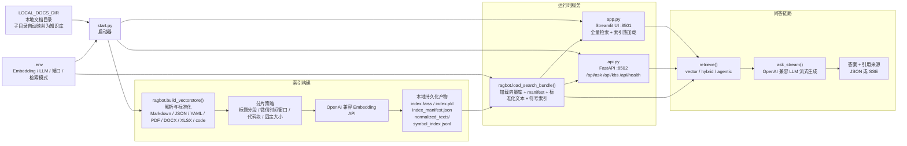
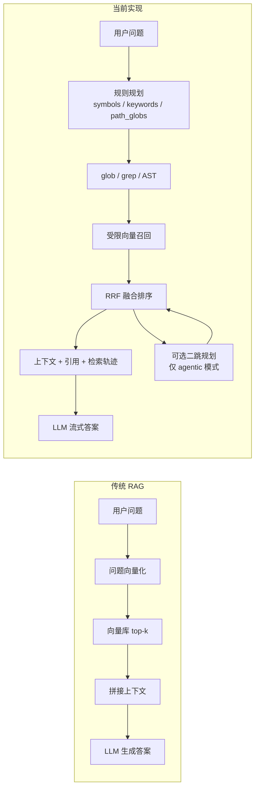

# OpenCortex

[](https://www.python.org/)
[](LICENSE)
[](https://streamlit.io/)
[](https://github.com/facebookresearch/faiss)

**轻量、本地优先的 RAG 对话工具。** 指定一个本地目录，自动建立向量索引，然后用任何 OpenAI 兼容的 LLM 与你的文档对话——数据全部留在你自己的机器上。

[English README](README.md)

---

## 功能亮点

- **零配置单页界面** — Streamlit，无需配置页
- **递归索引** — 支持 `.md`、`.txt`、`.json`、`.yaml`、`.csv`、`.rst`、`.log`、`.docx`、`.xlsx`、`.pdf` 等
- **微信导出支持** — 原生解析微信导出的 Markdown，按时间窗口分片
- **LLM 和 Embedding 可插拔** — 任意 OpenAI 兼容接口：硅基流动、Gemini、DeepSeek、Kimi、GLM 等
- **本地 FAISS 向量库** — 无云端依赖，数据不离本机
- **Hybrid / Agentic Search** — `glob + grep + AST + vector` 混合检索，支持有边界的二跳检索
- **多知识库** — `docs/` 下的子目录自动成为独立知识库，API 可指定知识库检索或全量检索
- **HTTP API** — FastAPI 端点（`/api/ask`、`/api/kbs`、`/api/health`），支持 `search_mode` 和 SSE 流式输出
- **索引热加载** — 更新文档后重建索引，无需重启服务，刷新页面即生效
- **Docker 部署** — 将同一知识库以局域网服务形式共享给多人
- **离线知识产物** — 额外生成 `wiki/`、`community_index.json`、`GRAPH_REPORT.md`、`query note` 和 `lint_report.json`，方便导航和维护

---

## 架构



当前实现的关键点：

1. `start.py` 默认先重建索引，再以两个子进程并行启动 Streamlit 和 Uvicorn。
2. `ragbot.py` 不只保存 FAISS，还会额外落盘 `index_manifest.json`、`normalized_texts/` 和 `symbol_index.jsonl`，供 hybrid / agentic 检索使用。
3. `app.py` 只做全量检索，但会监听 `index.faiss` 的 `mtime`，索引更新后自动清理缓存并热加载。
4. `api.py` 在 FastAPI lifespan 中加载同一套 `SearchBundle`，支持 `kb`、`search_mode`、`stream` 和 `debug` 参数。

### 离线知识产物

除了 FAISS 索引之外，OpenCortex 现在还会生成一组离线产物，帮助你做知识导航和后续维护：

- `wiki/index.md` 和 `wiki/files/*.md`：面向人类的文件导航页
- `wiki/queries/*.md`：在 UI 中显式点击“保存为知识”后生成的 query note
- `semantic_extract_cache.json`：LLM-assisted 语义抽取缓存
- `community_index.json` 和 `reports/GRAPH_REPORT.md`：结构摘要和社区报告
- `lint_report.json`：wiki 健康检查结果，当前覆盖 `stale_pages`、`orphan_pages`、`missing_links`

这些产物都是“二级知识”，不是最高优先级真相源。运行时回答仍然应优先回到原始文档和引用片段；wiki 和 query note 的价值在于导航、沉淀和复用。

如果重建索引时提供了 `LLM_API_KEY`、`LLM_BASE_URL` 和 `LLM_MODEL`，编译阶段还会额外执行一轮有边界的语义抽取，并把缓存命中、API 调用、token 用量和耗时写进 `index_manifest.json` / `community_index.json`。

### 问答链路

1. UI 或 API 收到问题后，统一调用 `ragbot.ask_stream()`。
2. `retrieve()` 先执行 `vector` / `hybrid` 检索；`agentic` 模式在必要时追加一次有边界的二跳检索。
3. 检索结果会被组装成上下文和引用来源，再交给任意 OpenAI 兼容 LLM 流式生成答案。
4. Streamlit 直接展示流式结果和引用卡片；FastAPI 则返回 JSON 或 SSE 事件流。

### 与传统 RAG 的区别



- `vector` 模式仍然是传统单路向量 RAG，适合作为性能和行为基线。
- 默认的 `hybrid` 模式会把规则检索和向量检索融合，更适合问文件名、符号名、配置项这类“可精确定位”的问题。
- `agentic` 模式不是无限循环的 agent，而是在首轮结果不够确定时，额外做一次有边界的二跳检索。

---

## 快速开始

### 本地运行（个人使用推荐）

需要 Python 3.12。

```bash
git clone https://github.com/yahuo/OpenCortex.git
cd OpenCortex

python3.12 -m venv venv
source venv/bin/activate       # Windows: venv\Scripts\activate
pip install -r requirements.txt

cp .env.example .env
# 编辑 .env，至少设置 LOCAL_DOCS_DIR、EMBED_API_KEY、LLM_API_KEY
```

启动（自动重建索引后启动 Web 服务）：

```bash
source venv/bin/activate
python3 start.py
```

浏览器访问 `http://localhost:8501`。

### Docker 部署（局域网多用户）

需要 Docker 和 Docker Compose v2。

```bash
cp .env.example .env
# 编辑 .env，设置 LOCAL_DOCS_DIR、EMBED_API_KEY、LLM_API_KEY
# LOCAL_DOCS_DIR 和 CHROMA_PERSIST_DIR 建议使用绝对路径
```

**首次部署：**

```bash
docker compose build
docker compose run --rm app python start.py --rebuild-only   # 建索引
docker compose up -d                                          # 启动服务
```

通过 `http://<服务器IP>:8501` 访问 UI，通过 `http://<服务器IP>:8502` 访问 API。

**文档更新后热加载（无需重启容器）：**

```bash
docker compose exec app python start.py --rebuild-only
# 刷新浏览器后自动加载新索引
```

`docker compose up -d` 会使用镜像默认命令 `python start.py --skip-rebuild`，因此容器重启时不会重复重建索引。

**常用运维命令：**

```bash
docker compose logs -f    # 查看日志
docker compose down       # 停止服务
docker compose up -d      # 重新启动
```

---

## 配置项

将 `.env.example` 复制为 `.env` 并填写所需参数。

| 变量 | 必填 | 默认值 | 说明 |
|---|:---:|---|---|
| `LOCAL_DOCS_DIR` | ✅ | `./docs` | 要索引的目录（递归） |
| `EMBED_API_KEY` | ✅ | — | Embedding 服务 API Key |
| `EMBED_BASE_URL` | | `https://api.siliconflow.cn/v1` | Embedding API 地址 |
| `EMBED_MODEL` | | `BAAI/bge-m3` | Embedding 模型名称 |
| `LLM_API_KEY` | ✅ | — | LLM 服务 API Key |
| `LLM_BASE_URL` | | `https://generativelanguage.googleapis.com/v1beta/openai/` | LLM API 地址 |
| `LLM_MODEL` | | `gemini-2.0-flash` | LLM 模型名称 |
| `CHROMA_PERSIST_DIR` | | `~/wechat_rag_db` | FAISS 索引持久化目录 |
| `SEARCH_MODE` | | `hybrid` | 默认检索模式：`vector` / `hybrid` / `agentic` |
| `SEARCH_MAX_STEPS` | | `2` | agentic 模式最大检索步数，仅支持 `1` 或 `2` |
| `EXCLUDE_GLOBS` | | — | 额外忽略的目录 / 文件模式，逗号分隔 |
| `SEARCH_DEBUG` | | — | Streamlit 中展示检索轨迹 |
| `APP_HOST` | | `127.0.0.1` | 服务绑定地址 |
| `APP_PORT` | | `8501` | Streamlit 服务端口 |
| `API_PORT` | | `8502` | FastAPI 服务端口 |

**兼容的 LLM 服务商**（设置对应的 `LLM_BASE_URL`）：

| 服务商 | Base URL |
|---|---|
| Gemini | `https://generativelanguage.googleapis.com/v1beta/openai/` |
| DeepSeek | `https://api.deepseek.com/v1` |
| Kimi（Moonshot） | `https://api.moonshot.cn/v1` |
| GLM（智谱） | `https://open.bigmodel.cn/api/paas/v4/` |
| 硅基流动 | `https://api.siliconflow.cn/v1` |

---

## 支持的文件类型

| 扩展名 | 分片策略 |
|---|---|
| `.md`、`.markdown`、`.mdx` | 微信导出格式 → 时间窗口分片；其他 Markdown → 固定大小分片 |
| `.txt`、`.rst`、`.log` | 固定大小分片（含重叠） |
| `.csv`、`.json`、`.yaml`、`.yml` | 固定大小分片（含重叠） |
| `.docx`、`.xlsx`、`.pdf` | markitdown 转 Markdown → 固定大小分片（含重叠） |

---

## HTTP API

除 Streamlit 界面外，OpenCortex 还通过 `api.py`（基于 FastAPI）提供 HTTP API，支持程序化调用。

`start.py` 会在 `8502` 端口同时启动 FastAPI 服务。也可单独运行：

```bash
uvicorn api:app --host 127.0.0.1 --port 8502
```

| 端点 | 方法 | 说明 |
|---|---|---|
| `/api/health` | GET | 健康检查 |
| `/api/kbs` | GET | 列出可用知识库 |
| `/api/ask` | POST | 提问（支持 `search_mode`、`debug` 和流式输出） |

### 多知识库

`LOCAL_DOCS_DIR` 下的子目录自动成为独立知识库：

```
docs/
├── 产品/     → 知识库 "产品"
├── 设计/     → 知识库 "设计"
└── readme.md → （无归属，仅全量检索）
```

**列出知识库：**

```bash
curl http://127.0.0.1:8502/api/kbs
# {"kbs": ["产品", "设计"]}
```

**指定知识库检索：**

```bash
curl -X POST http://127.0.0.1:8502/api/ask \
  -H "Content-Type: application/json" \
  -d '{"question": "产品路线图是什么？", "kb": "产品"}'
```

**指定检索模式并返回检索轨迹：**

```bash
curl -X POST http://127.0.0.1:8502/api/ask \
  -H "Content-Type: application/json" \
  -d '{"question": "bootstrap_session 在哪定义", "search_mode": "agentic", "debug": true}'
```

**全量检索（不传 `kb`）：**

```bash
curl -X POST http://127.0.0.1:8502/api/ask \
  -H "Content-Type: application/json" \
  -d '{"question": "产品路线图是什么？"}'
```

**SSE 流式输出：**

```bash
curl -N -X POST http://127.0.0.1:8502/api/ask \
  -H "Content-Type: application/json" \
  -d '{"question": "产品路线图是什么？", "stream": true}'
```

> 新增或调整子目录后，需要运行 `python start.py --rebuild-only` 重建索引。
---

## 目录结构

```
OpenCortex/
├── start.py          # 启动器：重建索引 → 启动 Streamlit + API
├── app.py            # Streamlit 单页界面
├── api.py            # FastAPI HTTP API（流式 + 非流式）
├── ragbot.py         # 核心：分片、向量化、FAISS、RAG 问答
├── Dockerfile        # 容器镜像定义
├── docker-compose.yml# 多用户部署编排
├── requirements.txt  # Python 依赖
└── .env.example      # 环境变量模板
```

---

## 参与贡献

欢迎提交 Issue 和 Pull Request。

1. Fork 本仓库
2. 新建分支（`git checkout -b feature/你的功能`）
3. 提交改动
4. 发起 Pull Request

---

## 许可证

[MIT](LICENSE) © 2024 OpenCortex contributors
