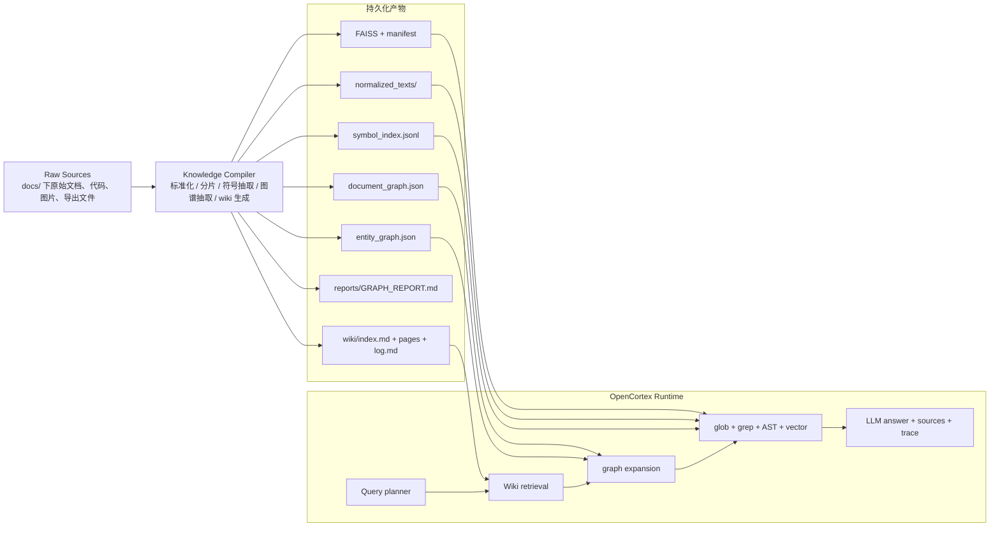
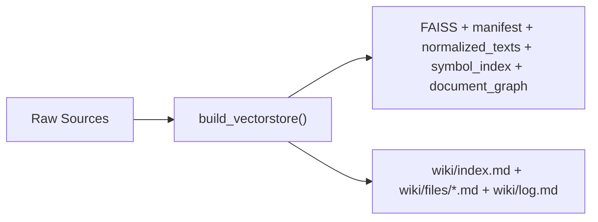

# OpenCortex × Graphify × LLM Wiki 整合设计文档

日期：2026-04-07
范围：本地知识库编译、结构化检索、长期知识沉淀

## 目标

将 OpenCortex 从“本地优先的 Hybrid RAG”升级为“三层知识系统”：

1. **运行时检索层**：保留 OpenCortex 现有的 `vector / hybrid / agentic` 问答能力。
2. **结构编译层**：引入 Graphify 风格的图谱与社区分析，把原始资料编译成更适合导航的结构化资产。
3. **长期沉淀层**：引入 Karpathy `llm-wiki` 的工作流，让回答、索引、对比、结论逐步沉淀为可持续维护的 wiki，而不是每次从原文重新推导。

## 关键结论

OpenCortex 已经具备整合的基础，不需要推倒重来。

1. 当前索引产物已经不只有 FAISS，还包括 `index_manifest.json`、`normalized_texts/`、`symbol_index.jsonl` 和 `document_graph.json`。
2. 当前检索链路已经支持 `glob + grep + AST + vector + bounded second hop`，具备“图辅助缩小向量召回范围”的雏形。
3. 最优解不是把 Graphify 当成新的在线问答服务，而是把它的优势下沉为**离线编译产物**。
4. `llm-wiki` 最值钱的部分不是某个具体实现，而是“让知识持续积累”的工作流：`raw sources -> wiki -> schema/log/lint`。

## 非目标

1. 不把 OpenCortex 改成依赖多 agent 平台的系统。
2. 不在在线问答请求链路里引入重型图谱抽取或社区检测。
3. 不让 wiki 取代原始文档成为唯一真相源。
4. 不复制 Graphify 的整套 skill prompt、平台安装逻辑和 agent 编排逻辑。

## 当前状态

### OpenCortex 已有能力

当前实现已经具备以下可复用资产：

- `ragbot.build_vectorstore()` 会在构建 FAISS 之外额外落盘标准化文本、manifest、symbol index 和 document graph。
- `retrieve()` 已经支持 `vector`、`hybrid`、`agentic` 三种模式。
- `agentic` 不是开放式循环，而是最多两步的有边界检索。
- API 已暴露 `search_mode`、`kb`、`debug`，适合继续承载整合后的运行时接口。

### Graphify 可复用能力

Graphify 值得借鉴的是：

- AST + 语义双通道抽取
- 显式边类型与置信度分级
- 社区检测与 god nodes / surprising connections 报告
- wiki 导出和图谱可视化

不建议直接复用的是：

- 平台相关的 skill 安装逻辑
- 强依赖 agent 子任务并行的 prompt 工作流
- 将语义抽取耦合到用户每次问答请求中的模式

### LLM Wiki 可复用能力

`llm-wiki` 更像一套知识工作流约束，而不是运行时检索引擎。最值得吸收的是：

- 原始资料和整理后知识分层存放
- `index.md` 作为导航入口
- `log.md` 或同类日志记录增量结论
- `lint` 检查孤儿页、过期页、冲突结论、缺失链接
- 把“好答案”回写为可复用知识，而不是只留在聊天历史里

## 提议架构

下图是**目标态架构**，不是 Phase 1 的实施范围。Phase 1 只会生成离线 wiki 产物，不会接入 `WikiSearch -> GraphScope -> Hybrid` 这条运行时链路。



Phase 1 的简化形态如下：



## 核心设计原则

1. **Raw sources 仍是唯一真相源**：wiki、graph、report 都是派生物。
2. **结构先于生成**：先编译出图和 wiki，再把它们作为运行时检索的高价值候选源。
3. **在线链路只消费产物**：图谱抽取、社区检测、wiki 生成都在离线构建阶段完成。
4. **答案可回写，但必须带来源**：回写内容只能作为二级知识，必须能追溯到原始文档。
5. **先证明离线产物有价值，再决定是否接入 runtime**：首个 PR 只生成 wiki 产物，不提前改检索链路。

## 持久化产物设计

建议在现有 `persist_dir` 下扩展为：

```text
<persist_dir>/
├── index.faiss
├── index.pkl
├── index_manifest.json
├── normalized_texts/
├── symbol_index.jsonl
├── document_graph.json
├── entity_graph.json
├── community_index.json
├── reports/
│   └── GRAPH_REPORT.md
├── wiki/
│   ├── index.md
│   ├── log.md
│   ├── communities/
│   ├── entities/
│   ├── files/
│   └── queries/
└── lint_report.json
```

### 各产物职责

| 产物 | 职责 |
|------|------|
| `index.faiss` | chunk 级语义召回 |
| `normalized_texts/` | grep / snippet / file-back 证据源 |
| `symbol_index.jsonl` | AST / 精确符号检索 |
| `document_graph.json` | 文件级关联图，用于快速 scope expansion |
| `entity_graph.json` | 实体级图谱，支持概念跳转、社区分析、解释链路 |
| `community_index.json` | 社区标签、god nodes、跨社区桥信息 |
| `reports/GRAPH_REPORT.md` | 面向人的结构摘要 |
| `wiki/index.md` | agent 和用户都能读的导航入口 |
| `wiki/log.md` | 增量知识日志 |
| `wiki/queries/` | 可选，沉淀高价值问答 |
| `lint_report.json` | wiki 健康检查结果 |

## 目标态查询链路设计

本节描述的是目标态，而不是首个 PR。首个 PR 不改运行时检索链路。

目标态回答链路不再只依赖 chunk 检索，而改为“四段式”：

### 1. Query planning

沿用现有 `QueryPlan` 机制，继续只输出：

- `symbols`
- `keywords`
- `path_globs`
- `semantic_query`

不在首阶段新增 `wiki_terms` 或 `intent`。如果后续确实出现不同检索分流策略，再单独扩展字段。

### 2. Wiki first（目标态）

先查 `wiki/index.md`、社区页、实体页、历史 query 页。

目标不是直接拿 wiki 当最终答案，而是：

- 快速缩小候选主题范围
- 找到高价值实体名和社区名
- 找到已沉淀的术语映射、别名、结论页

这里的前提是 wiki 已经包含源文件之外的增量结构，例如：

- `index.md` 导航页
- 社区页
- 实体页
- 历史 query 页
- 对比/总结页

如果 wiki 只是 `manifest + normalized_texts` 的 markdown 包装，那么它在运行时的检索增量会非常有限，不值得在 Phase 1 接入。

### 3. Graph scoped retrieval（目标态）

在 wiki 和首轮命中基础上做图扩展：

- 先走现有 `document_graph.json`
- 命中 entity 页或社区页时，再走 `entity_graph.json`
- 将扩展结果作为 `candidate_sources`，继续约束后续 grep / vector 召回

这一步的目标是减少“无关 chunk 占预算”，而不是把图谱当作单独答案引擎。

### 4. Evidence retrieval and answer（目标态）

保留当前 OpenCortex 的强项：

- `glob`
- `grep`
- `ast`
- `vector`
- bounded `agentic` second hop

最后仍由原始文档 chunk 组成最终上下文，保证回答可追溯。

## 回写链路设计

`llm-wiki` 的核心价值在回写。建议增加“显式接受后回写”的机制，而不是默认把每个回答都落盘。

### 回写对象

1. 高价值问答
2. 实体解释
3. 跨文档对比结论
4. 操作流程总结

### 回写位置

- `wiki/queries/YYYY-MM-DD-<slug>.md`
- `wiki/log.md`

### 回写格式

每条回写内容至少包含：

- 问题
- 结论
- 来源文件列表
- 来源片段位置
- 生成时间
- 可选标签

### 回写原则

1. 回写内容必须链接回原始文件或 wiki 页面。
2. 回写内容默认不是训练数据，也不是最高优先级证据。
3. 运行时引用回写内容时，仍优先补充 raw source 证据。

## 图谱升级策略

### Phase 2A：新增规则可抽取的 entity graph

在保留 `document_graph.json` 的前提下，新增 `entity_graph.json`，但范围先限制在无需 LLM 的节点和边。

建议节点类型：

- `file`
- `section`
- `symbol`

建议边类型：

- `contains`
- `defines`
- `references`
- `calls`
- `imports`
- `links_to`
- `mentions_path`
- `same_series`
- `shared_symbol`

建议置信度：

- `EXTRACTED`
- `INFERRED`

这一步的目标是先验证“实体级 scope expansion”是否真的比 file-level graph 更有增量价值。

### Phase 2B：新增 LLM-assisted 语义实体与关系

只有在 Phase 2A 已证明规则图谱有价值之后，才考虑引入需要 LLM 的语义节点和边。

候选节点类型：

- `concept`
- `person`
- `system`
- `decision`
- `query_note`

候选边类型：

- `rationale_for`
- `semantically_related`
- 其他跨文档语义关系

这一步必须显式设计：

- 抽取缓存
- 增量更新
- 构建耗时预算
- API 调用成本
- 失败回退策略

### Phase 3：社区与报告

在 entity graph 稳定后增加：

- `community_index.json`
- `reports/GRAPH_REPORT.md`
- UI 中的结构摘要卡片

这一步才真正吸收 Graphify 的社区分析价值。

## 模块拆分建议

当前 `ragbot.py` 确实偏大，但模块拆分不应与首个功能 PR 绑定。

原则：

1. Phase 1 不做大规模文件拆分，只允许新增 `wiki.py` 这类独立文件。
2. 等 wiki 产物和后续图谱能力被证明有价值后，再将拆分作为独立 PR。
3. 模块拆分 PR 不同时引入新的检索行为变化。

目标态可考虑按职责拆成：

| 模块 | 职责 |
|------|------|
| `compiler.py` | 总入口，负责编译所有产物 |
| `normalize.py` | 文件标准化与文本抽取 |
| `chunking.py` | 分片策略 |
| `symbols.py` | AST / symbol index |
| `doc_graph.py` | file-level graph |
| `entity_graph.py` | entity-level graph |
| `wiki.py` | wiki 生成、回写、lint |
| `search.py` | 运行时检索编排 |
| `answering.py` | prompt 与流式回答 |

## API 变化建议

现有 `/api/ask` 可以保留，但建议逐步扩展返回结构：

```json
{
  "answer": "...",
  "sources": [],
  "search_trace": [],
  "wiki_trace": [],
  "graph_trace": [],
  "artifacts": {
    "wiki_pages": [],
    "community_pages": []
  }
}
```

可选新增端点：

- `GET /api/wiki/index`
- `GET /api/wiki/page/{slug}`
- `POST /api/wiki/save-query`
- `GET /api/graph/report`

这些端点都不是首阶段必须项。首阶段不改 `/api/ask`。

## 实施阶段

### Phase 1：只生成离线 wiki 产物

目标：以最低风险验证 wiki 对“人类导航”是否有价值，不修改运行时行为。

改动：

1. 新增 `wiki.py`
2. 在构建阶段生成 `wiki/index.md`、`wiki/files/*.md`、`wiki/log.md`
3. 仅使用现有 `index_manifest.json` 和 `normalized_texts/` 作为输入

不做：

- 不在 `retrieve()` 中增加 wiki 检索步骤
- 不改 `SearchBundle`
- 不加 `wiki_trace`
- 不做 entity graph
- 不做社区检测
- 不做自动回写
- 不拆分 `ragbot.py`

验收标准：

1. 构建完成后稳定生成 `wiki/index.md`、`wiki/files/*.md`、`wiki/log.md`
2. 现有 `vector / hybrid / agentic` 行为零回归
3. 人工 spot-check 至少 3 个知识库样本时，`wiki/index.md` 能帮助快速定位到相关文件页

### Phase 2A：规则图谱升级

目标：把当前 file-level graph 升级为 file + rule-based entity 双图模式。

改动：

1. 新增 `entity_graph.json`
2. 仅抽取 `file / section / symbol`
3. 图扩展逻辑优先尝试实体图，回落文件图
4. 回答中可选输出“桥接实体”信息

验收标准：

1. `entity_graph.json` 可稳定生成，节点和边都能回溯到源文件
2. 在一组固定的 20 条 benchmark query 中，至少 5 条 query 因 entity graph 新增了未被 `document_graph` 覆盖的有效候选
3. 不降低现有 `document_graph` 相关回归测试稳定性

### Phase 2B：LLM-assisted 语义图谱

目标：为 entity graph 增加规则无法抽取的语义节点和关系。

改动：

1. 增加语义节点和边的抽取流程
2. 增加缓存与增量更新机制
3. 为构建阶段增加成本与耗时记录

验收标准：

1. 单次全量构建耗时和 API 成本可量化
2. 缓存命中后重建成本显著下降
3. 固定 query 集上，语义图谱相对 Phase 2A 有可证明增益

### Phase 3：报告与可视化

目标：提升“理解知识库结构”的能力，而不只是问答。

改动：

1. 生成 `community_index.json`
2. 生成 `reports/GRAPH_REPORT.md`
3. 在 UI 中展示 god nodes / surprising connections / suggested questions

验收标准：

1. 社区与报告产物可稳定生成
2. 在固定样本库上不存在明显误聚类导致的错误摘要
3. UI 展示不影响现有问答主路径

### Phase 4：回写与 lint

目标：让知识随使用而积累。

改动：

1. 增加显式“保存为知识”操作
2. 落盘到 `wiki/queries/`
3. 增加 `lint_report.json`
4. 在构建或定时任务中执行 lint

验收标准：

1. 回写内容必须包含来源文件和片段位置
2. lint 可识别 stale page、孤儿页和缺失链接三类问题
3. 回写内容默认不进入最高优先级检索证据链

## 风险与应对

### 1. 编译产物过多，重建时间变长

应对：

- 所有新产物都走增量构建
- 将 entity graph 和社区分析做成可选阶段
- 在线请求只读产物，不触发重建

### 2. wiki 与原文漂移

应对：

- 每个 wiki 页都记录来源文件和更新时间
- 原文变更时标记相关 wiki 页 stale
- lint 报告中加入 stale page 检查

### 3. 图谱误连导致错误 scope expansion

应对：

- 文件图和实体图分开使用
- 仅把图谱作为 scope narrowing 和 explanation 辅助，不直接作为最终证据
- 保留现有优先级与回归测试策略

### 4. `ragbot.py` 继续膨胀

应对：

- Phase 1 只允许新增 `wiki.py` 这样的独立文件，不伴随大规模拆分
- 模块拆分单独立项，且不与检索行为变化绑定

## 推荐首个落地 PR

建议先做一组低风险改动：

1. 新增 `wiki.py`，从现有 manifest 和 normalized texts 生成 `wiki/index.md`、`wiki/files/*.md`、`wiki/log.md`
2. 在 `build_vectorstore()` 末尾调用 wiki 生成逻辑
3. 不修改现有 vector / hybrid / agentic 的核心排序逻辑

这一步的目的是先证明 wiki 作为离线产物本身有价值，再决定是否值得接入 runtime。

## 一句话结论

OpenCortex 应继续做运行时问答底座，Graphify 的价值应被吸收为离线结构编译能力，Karpathy `llm-wiki` 的价值应被吸收为长期知识沉淀机制。三者整合后的正确形态是：

**OpenCortex Runtime + Knowledge Compiler + LLM Wiki Workflow**
